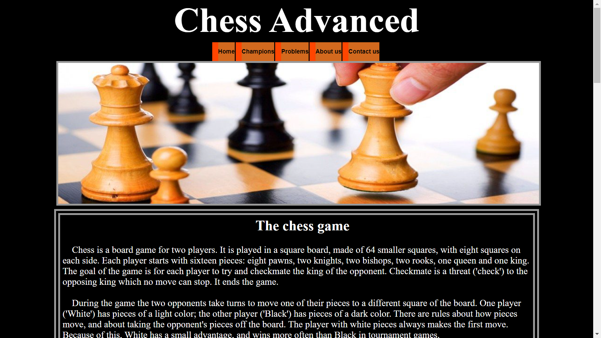
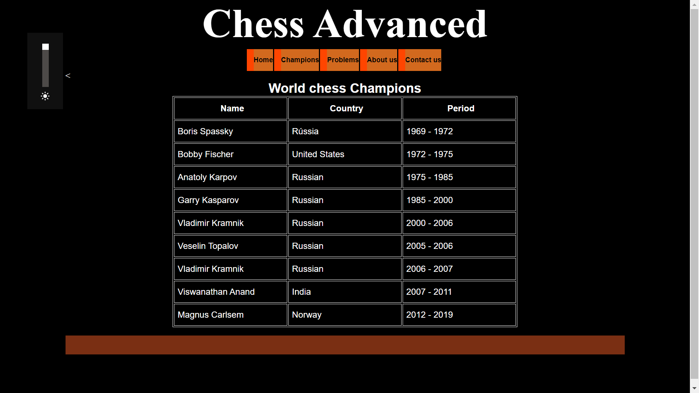

# Project Site Chess
<br />
<p align="center">
  <a href="https://github.com/alexanderritik/Best-README-Template">
    
  </a>
  <h3>
  <p align="center">


This project of site shows a little about the history of chess, its basic rules, greatest players in history and has a small section of chess problems </p>
</p>
</h3>
<p align="center">
    
</p>
<br>
<p align="center">
    
</p>

## Tools and languages ​​used

HTML5<br>
Css3<br>
Ide Visual Code


## Requirements

Any  internet browser 


## Installation


No installation required
 Just right click and open with a browser


## Download

Download at
``
https://github.com/Alexande-Alves/Projeto-site

or download via ssh key
```
git@github.com:Alexande-Alves/Projeto-site.git
```

## Usage example

The Navigation of the site is done through tabs that, when clicked, give access to other pages on the site.
  There are a problem's section and two lists of world champions and a contact form  for more informations.


## Meta


[https://github.com/Alexande-Alves](https://github.com/dbader/)

[swift-image]:https://img.shields.io/badge/swift-3.0-orange.svg
[swift-url]: https://swift.org/
[license-image]: https://img.shields.io/badge/License-MIT-blue.svg
[license-url]: LICENSE
[travis-image]: https://img.shields.io/travis/dbader/node-datadog-metrics/master.svg?style=flat-square
[travis-url]: https://travis-ci.org/dbader/node-datadog-metrics
[codebeat-image]: https://codebeat.co/badges/c19b47ea-2f9d-45df-8458-b2d952fe9dad
[codebeat-url]: https://codebeat.co/projects/github-com-vsouza-awesomeios-com
